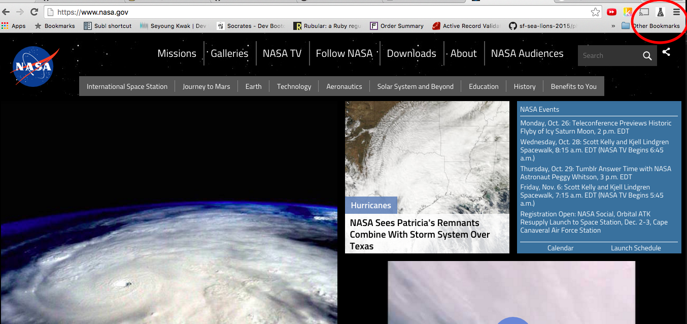
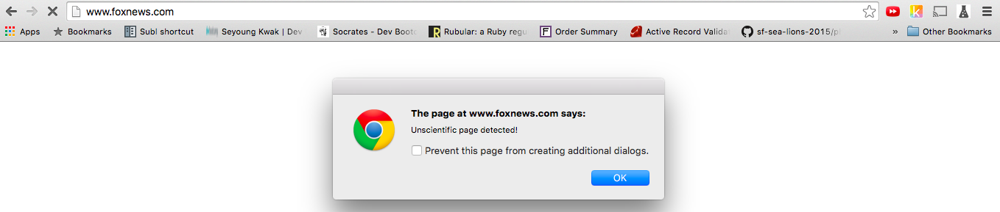
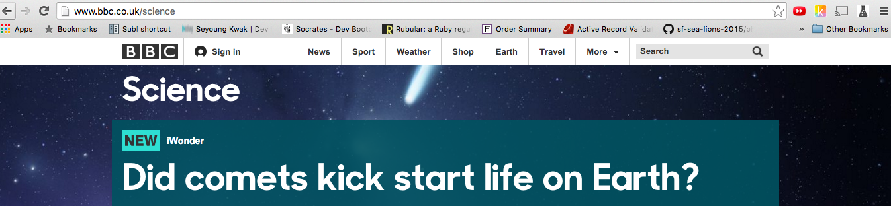

#Sciencify

## The best and most scientific Chrome Extension in the world

Sciencify will block users visiting unscientific website like foxnews.com and redirect them regit science site like sciencemag.com

This is Science Hack Day Project on Oct 24, 2015. The Collaborators are: 
- sarahkwak
- Missling
- miniyakkos
- TriathlonCodes

When users try to go www.foxnews.com, the popup says "Protect you from unscientific ideas" and then...

redirect to bbb.com/science

The detailed information about the extension will be available in chrome app store. 